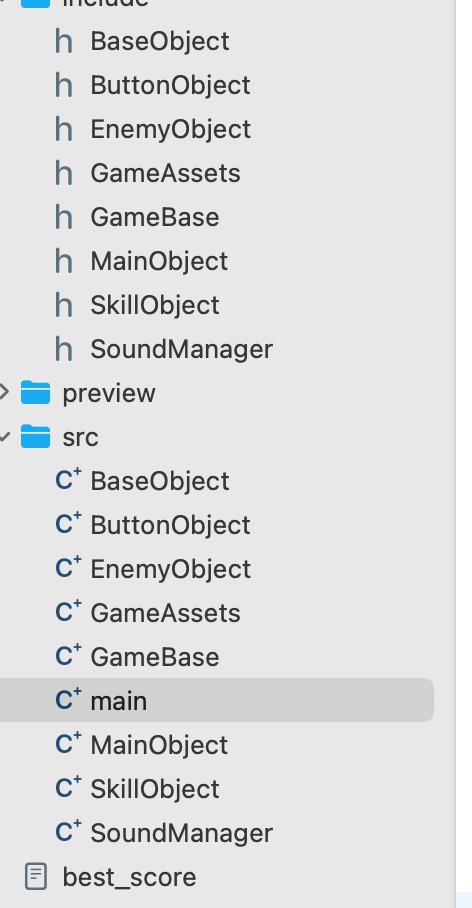

# FELINE FRIGHTS: BÀI TẬP LẬP TRÌNH NÂNG CAO INT2215
## I. Thông tin tác giả
- **Họ và tên:** Nguyễn Văn Hiếu 
- **Mã số sinh viên:** 24021478
- **Lớp:** K69I - CS2
- **Ngành học:** Khoa học máy tính - CN8
## II. Tổng quan về game

  

- **Video demo:** [Youtube](https://www.youtube.com/watch?v=JaFAb-kBu4Y)
- **Thể loại**:  Action / Endless
- **Nền tảng:** PC
- **Ngôn ngữ**: C++ /  SDL2
- **Tóm tắt:** Trong Feline Frights, người chơi điều khiển một chú mèo học phép thuật, vẽ các hình dạng (như đường thẳng, chữ V, v.v.) để chiến đấu với các quái vật. Người chơi sẽ vẽ các hình dạng trên màn hình để tiêu diệt các quái vật đang tiến tới, đồng thời tránh để quái vật tấn công mình. Game có độ khó tăng dần (càng ngày sẽ có càng nhiều quái xuất hiện) và không có kết thúc, với mục tiêu là duy trì sống sót càng lâu càng tốt.
- **Ngưỡng điểm mong muốn:** 9 - 10
## III. Các điểm nổi bật của Feline Frights

### 1. Kiến trúc hướng đối tượng rõ ràng, dễ mở rộng (Game Structure)

  

- Game được xây dựng theo **kiến trúc hướng đối tượng (OOP)**, với mỗi thành phần trong game như nhân vật chính (MainObject), quái vật (EnemyObject), nút bấm (ButtonObject), kỹ năng (SkillObject) đều là các class riêng biệt kế thừa từ BaseObject. Mỗi class quản lý logic và trạng thái riêng, giúp mã nguồn **dễ hiểu, dễ bảo trì, dễ mở rộng**. Ngoài ra, tách riêng phần **quản lý tài nguyên** (GameAssets), **xử lý âm thanh** (SoundManager), **khởi tạo hệ thống** (GameBase) để code được **module hóa** và dễ tổ chức hơn.
###  2. Hệ thống quái vật có hành vi linh hoạt và đa dạng (Enemy Behavior System)

  

  

- **Xuất hiện liên tục**: Quái vật sẽ được spawn đều đặn và **ngày càng nhiều** (sau mỗi 60s giảm 100ms, min 1000ms) khi người chơi đạt điểm cao → tăng độ khó theo thời gian.
- **Cơ chế boss**: Boss xuất hiện sau mỗi 3000 điểm (~30 quái) với lượng máu **gấp đôi**, sau 7s nếu người chơi không giết sẽ bị trừ máu, giết boss sẽ được hồi full máu
- **Hướng di chuyển trái/phải**: Quái vật có thể xuất hiện từ hai bên màn hình, và hiển thị animation khác nhau tùy hướng 
- **Skill tương ứng**: Mỗi quái yêu cầu người chơi vẽ đúng **một chuỗi skill tương ứng (random từ 1 -> 5)** mới có thể tiêu diệt, tăng tính chiến lược khi chơi.
- **Animation khi bị thương/chết**: Có các texture riêng cho **bị thương** và **chết** (enemyHurtRightTexture, enemyDieLeftTexture, …) giúp game sống động và có phản hồi rõ ràng khi đánh trúng.
### 3. Hệ thống xử lý kỹ năng vẽ (Skill Detection)
Trong game, thay vì bấm nút để tấn công, người chơi phải **vẽ một hình dạng cụ thể bằng chuột** để thi triển kỹ năng. Đây là điểm nổi bật giúp gameplay khác biệt so với các game đơn thuần dùng bàn phím.
#### Các kỹ năng được nhận diện:
- **isHorizontalLine()** → kỹ năng gạch ngang —
- **isVerticalLine()** → kỹ năng gạch dọc |
- **isVLine()** → kỹ năng hình chữ V
- **isLightningLine()** → kỹ năng tia sét ⚡ (dùng ultimate)
#### Các thuật toán tự viết:

- **Phân tích vector điểm** để xác định hướng chính, độ lệch, góc thay đổi.
- Với skill ⚡, thuật toán tính **góc giữa các đoạn liên tiếp**, nếu có nhiều đoạn ngoặt gấp (zigzag) → nhận là tia sét.
- Tự kiểm soát ngưỡng sai lệch cho mỗi loại skill, **tạo độ linh hoạt** khi vẽ tay nhưng vẫn đảm bảo chính xác.
### 4. Hệ thống hoạt ảnh (Animation System)

  

- Game sử dụng hệ thống hoạt ảnh linh hoạt để hiển thị chuyển động và trạng thái của nhân vật chính, đảm bảo phản hồi trực quan mỗi khi người chơi thực hiện hành động - mỗi hành động đều có ảnh động riêng (vẽ skill, trúng đòn, đợi…).
### 5. Hệ thống bổ trợ (Additional System)
#### 5.1. Hệ thống âm thanh đầy đủ, có tùy chỉnh

  

- Sử dụng **SDL_mixer** để quản lý toàn bộ âm thanh trong game: nhạc nền, âm hiệu khi vẽ, chọn menu, tấn công, pause, bị thương, v.v.
- Phân chia âm thanh thành **music** (bgm) và **effect** (chunk), load sẵn từ đầu bằng SoundManager.
- Tích hợp **volume on/off** trong menu pause:
    - Người chơi có thể **bật/tắt âm thanh** bằng cách click nút icon loa.
    - Giao diện sẽ cập nhật giữa volume_on_button.png và volume_off_button.png tương ứng.
#### 5.2. Lưu và quản lý điểm số
- Game có cơ chế **tính điểm và điểm cao nhất (best score)**:
    - Khi tiêu diệt quái, người chơi nhận điểm.
    - Khi game over, điểm cao nhất được **lưu vào file** bằng saveBestScore() và được **đọc lại mỗi lần chạy game**.
- Hiển thị điểm hiện tại, điểm cao nhất và số quái tiêu diệt ngay trên **màn hình Game Over**
## IV. Tài liệu tham khảo
- [Game gốc: Magic Cat Academy](https://doodles.google/doodle/halloween-2016/)
- [Lazy Foo' Productions](https://lazyfoo.net/tutorials/SDL/index.php).
- [Trang chính thức của SDL2](https://www.libsdl.org/).
- Âm thanh từ Dead Cell's soundtrack
- Các asset khác từ canva
- Có sử dụng ChatGPT để hỏi đáp, cải thiện code
- Không sử dụng bất kì nguồn nào khác ngoài các nguồn đã kể
